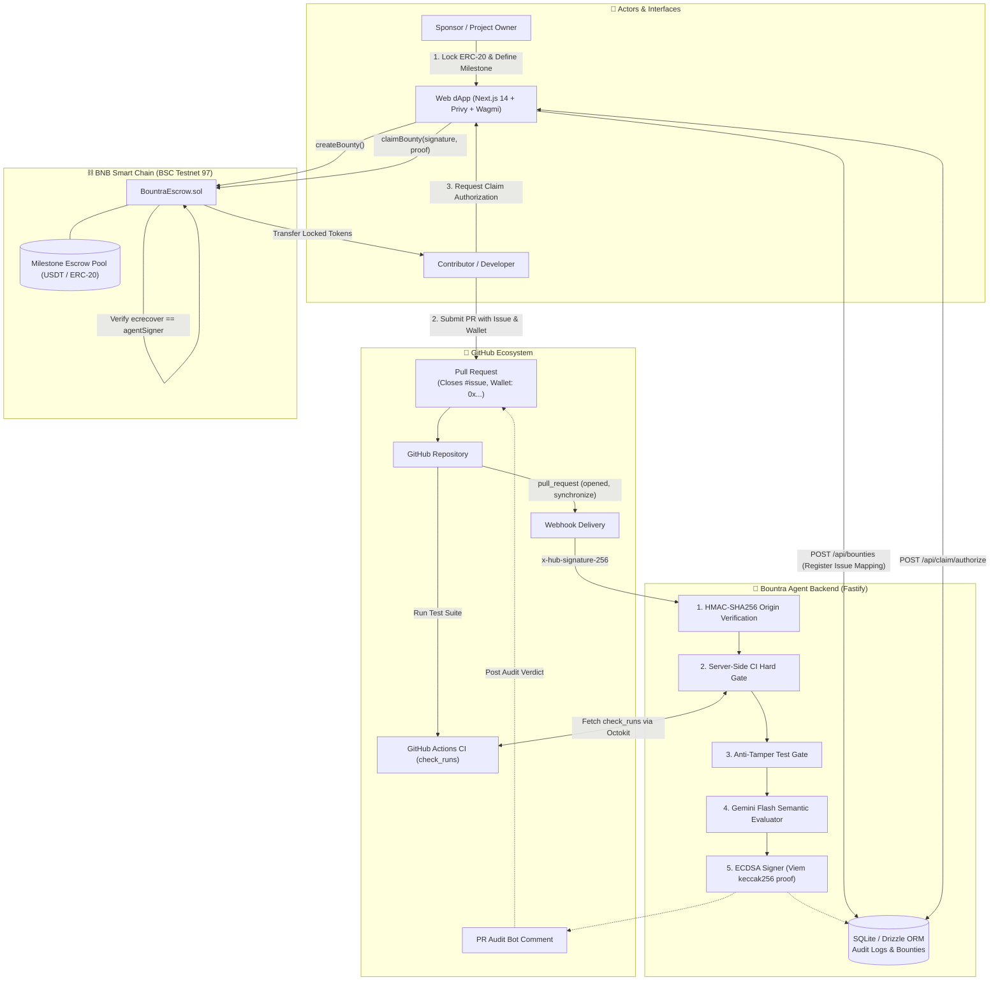
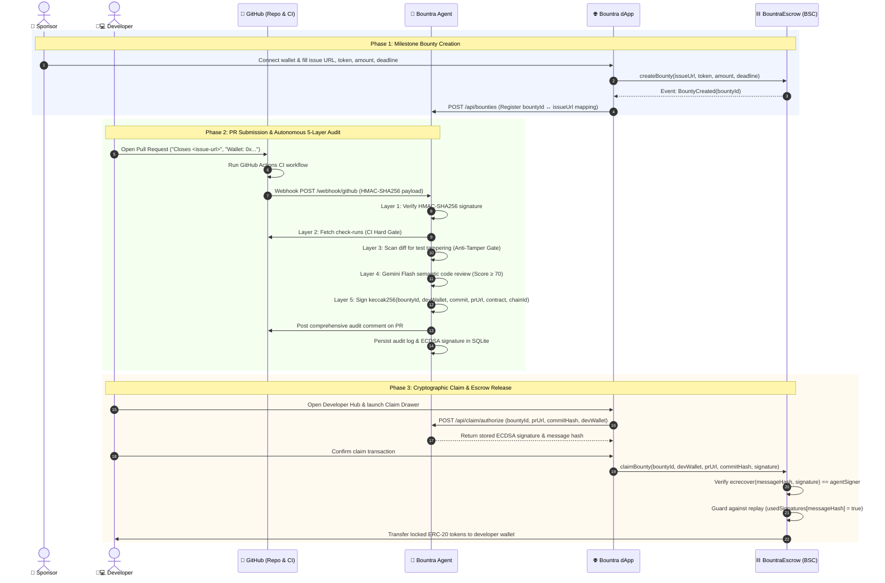

# Bountra

> **Autonomous GitHub PR Auditor & Code-Gated Milestone Escrow on BNB Chain** 

[](https://soliditylang.org/)
[](https://book.getfoundry.sh/)
[](https://fastify.dev/)
[](https://nextjs.org/)
[](https://testnet.bscscan.com/address/0xbe576879961Bd8cdf7CfA72F146C8a3E352c7260)

---

## 🌟 Executive Summary

**Bountra** eliminates human review bottlenecks and milestone payment delays in Web3 open-source development. Sponsors lock milestone bounties in escrow on BNB Smart Chain. When a developer submits a pull request on GitHub, Bountra's AI Agent executes a rigorous **5-layer automated security and quality audit pipeline**:

1. **GitHub HMAC Verification** — Authenticates authentic webhook delivery origin via HMAC-SHA256 (`x-hub-signature-256`).
2. **CI Hard Gate** — Fetches GitHub Actions check-runs server-side; non-passing test suites fail immediately with zero LLM expenditure.
3. **Anti-Tamper Gate** — Audits git diffs for unauthorized modifications to protected test cases, workflows, and CI configurations.
4. **Gemini Flash Code Evaluation** — Performs sandboxed, XML-delimited semantic code review enforcing strict JSON Schema structured output.
5. **ECDSA Cryptographic Attestation** — Produces a signed on-chain claim authorization proof (`keccak256(bountyId, devWallet, commitHash, prUrl, contractAddress, chainId)`).

Once attested, the developer triggers escrow release on-chain via the Developer Hub. If a milestone expires without a valid submission, the sponsor reclaims 100% of their deposited funds.

---

## 📜 Deployed Contracts

| Network | Contract | Address | Explorer / Role |
|---|---|---|---|
| **BSC Testnet (Chain ID 97)** | `BountraEscrow.sol` | `0xbe576879961Bd8cdf7CfA72F146C8a3E352c7260` | [BscScan Testnet](https://testnet.bscscan.com/address/0xbe576879961Bd8cdf7CfA72F146C8a3E352c7260) |
| **Agent Signer Key** | Viem ECDSA Signer | `0x2e10F4a41F665c657Ff4deC4A780e8734A066848` | On-Chain Attestation Signer |

---

## 🏛️ System Architecture



---

## 🔄 User Flow & Lifecycle



### Detailed Lifecycle Phases

1. **Milestone Creation & Funding**:
   - The sponsor specifies the target GitHub Issue, ERC-20 token, reward amount, and deadline on the dApp.
   - The contract transfers tokens into escrow and emits `BountyCreated`.
   - The dApp registers the `bountyId ↔ issueUrl` mapping with the agent backend via `POST /api/bounties`.

2. **PR Submission & Multi-Gate Audit**:
   - The contributor opens a Pull Request referencing the issue and their payout address:
     ```markdown
     Closes https://github.com/<owner>/<repo>/issues/<id>
     Wallet: 0xYourBscAddressHere
     ```
   - Only `opened` and `synchronize` webhook actions trigger audits. Non-diff actions (`closed`, `labeled`, `edited`) return `200 ignored` immediately without LLM costs.
   - The pipeline sequentially verifies HMAC, checks GitHub CI completion, audits test integrity, and passes sandboxed diffs to Gemini Flash.
   - If score $\ge 70$ and no security issues are found, the agent signs an ECDSA authorization hash and posts the verdict comment to GitHub.

3. **Escrow Claiming**:
   - The developer opens the Developer Hub on the dApp.
   - The frontend calls `POST /api/claim/authorize` through the Next.js server proxy (`/api/agent/...`) to retrieve the stored passing signature.
   - The developer submits `claimBounty(...)` on BNB Chain. The smart contract validates the agent's signature on-chain and releases the bounty funds directly to the developer's wallet.

---
ß
## 📁 Repository Structure

```
bountra/
├── contracts/               # Foundry Smart Contracts (Solidity 0.8.28, Cancun EVM)
│   ├── src/BountraEscrow.sol    # Core code-gated escrow & ECDSA verification logic
│   ├── test/BountraEscrow.t.sol  # Reentrancy, replay guard, and authorization test cases
│   └── script/Deploy.s.sol      # Deployment script for BSC/opBNB Testnet
├── agent/                   # Autonomous Auditor Backend (Fastify + TypeScript)
│   ├── src/evaluator/           # Gemini Flash structured review & anti-tamper security
│   ├── src/signer/              # Viem ECDSA claim attestation signing
│   ├── src/security/            # HMAC-SHA256 signature verification
│   ├── src/routes/              # Webhook endpoint & claim authorization proxy
│   └── src/db/                  # SQLite schema & Drizzle ORM client
├── web/                     # Frontend dApp (Next.js 14 App Router + Tailwind + Wagmi)
│   ├── src/app/page.tsx         # Landing page, pipeline visualizer, audit terminal
│   ├── src/app/explore/page.tsx # Bounty directory & creation modal
│   ├── src/app/dashboard/       # Sponsor Escrow Management & Developer Claims
│   └── src/components/modals/   # CreateBountyModal & ClaimBountyDrawer
└── docs/                    # Technical specs, architecture, & master plan
```

---

## 📄 License

MIT License. Built with ❤️ for the BNB Chain Ecosystem.
