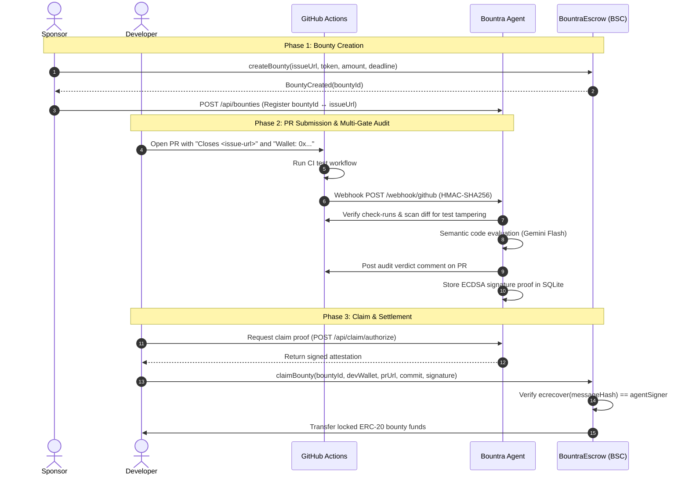

# Bountra

> **Autonomous GitHub PR Auditor & Code-Gated Milestone Escrow on BNB Chain**

[](https://soliditylang.org/)
[](https://book.getfoundry.sh/)
[](https://fastify.dev/)
[](https://nextjs.org/)
[](https://testnet.bscscan.com/address/0xbe576879961Bd8cdf7CfA72F146C8a3E352c7260)

---

## 🌟 Executive Summary

**Bountra** eliminates human review bottlenecks and milestone payment delays in Web3 open-source development. Project sponsors lock milestone bounties in escrow on BNB Smart Chain. When a developer submits a pull request on GitHub, Bountra's AI Agent executes a rigorous **5-layer automated security and quality audit pipeline**:

1. **GitHub HMAC Verification** — Authenticates authentic webhook delivery origin via HMAC-SHA256 (`x-hub-signature-256`).
2. **CI Hard Gate** — Fetches GitHub Actions check-runs server-side; non-passing test suites fail immediately with zero LLM expenditure.
3. **Anti-Tamper Gate** — Audits git diffs for unauthorized modifications to protected test cases, workflows, and CI configurations.
4. **Gemini Flash Code Evaluation** — Performs sandboxed, XML-delimited semantic code review enforcing strict JSON Schema structured output.
5. **ECDSA Cryptographic Attestation** — Produces a signed on-chain claim authorization proof (`keccak256(bountyId, devWallet, commitHash, prUrl, contractAddress, chainId)`).

Once attested, the developer triggers escrow release on-chain via the Developer Hub. If a milestone expires without a valid submission, the sponsor reclaims 100% of their deposited funds.

---

## 📜 Deployed Contracts

| Network | Contract | Address | Explorer / Role |
|---|---|---|---|
| **BSC Testnet (Chain ID 97)** | `BountraEscrow.sol` | `0xbe576879961Bd8cdf7CfA72F146C8a3E352c7260` | [BscScan Testnet](https://testnet.bscscan.com/address/0xbe576879961Bd8cdf7CfA72F146C8a3E352c7260) |
| **Agent Signer Key** | Viem ECDSA Signer | `0x2e10F4a41F665c657Ff4deC4A780e8734A066848` | On-Chain Attestation Signer |

---

## 🏛️ System Architecture

```
┌────────────────────────────────────────────────────────────────────────┐
│                          BOUNTRA PROTOCOL                              │
└────────────────────────────────────────────────────────────────────────┘

  [1. Deposit]                   [2. Webhook]                    [4. Claim]
Sponsor (Web dApp)              GitHub PR Event              Developer (Web dApp)
       │                               │                              │
       ▼                               ▼                              ▼
┌──────────────┐               ┌───────────────┐              ┌───────────────┐
│ BountraEscrow│               │ Bountra Agent │              │ BountraEscrow │
│  (BSC 97)    │               │ (Fastify API) │              │  (BSC 97)     │
└──────────────┘               └───────┬───────┘              └───────┬───────┘
                                       │                              │
                        ┌──────────────┴──────────────┐               │
                        │ 5-Layer Security Pipeline   │               │
                        │  1. HMAC-SHA256 Origin Gate │               │
                        │  2. GitHub Actions CI Gate  │               │
                        │  3. Anti-Tamper Diff Scan   │               │
                        │  4. Gemini Flash Semantic   │               │
                        │  5. Viem ECDSA Signer       │               │
                        └──────────────┬──────────────┘               │
                                       │                              │
                        [3. Cryptographic Signature]                  │
                                       └──────────────────────────────┘
                                          ecrecover() releases escrow
```

### Component Overview

- **Smart Contract Layer (`contracts/`)**: `BountraEscrow.sol` holds ERC-20 deposits in escrow on BSC Testnet. Releases funds strictly upon verifying the agent's ECDSA signature via `ecrecover` with non-replayable digests (`usedSignatures[digest]`).
- **Autonomous Agent Backend (`agent/`)**: Fastify microservice running Octokit, Drizzle ORM (SQLite), and Gemini Flash. Validates incoming PR events, queries CI check-runs, inspects test integrity, performs semantic evaluation, and issues signed attestations.
- **Frontend dApp (`web/`)**: Next.js 14 App Router with Tailwind CSS, Privy wallet authentication, and Wagmi/Viem. Provides the Bounty Explorer, Sponsor Escrow Manager, and Developer Claim Drawer.

---

## 🔄 User Flow & Lifecycle



### Lifecycle Highlights

1. **Bounty Funding**: Sponsors lock rewards into `BountraEscrow.sol` and register the bounty with the agent backend so incoming PRs can be matched.
2. **Autonomous Audit**: PRs must reference the issue (`Closes <issue-url>`) and payout wallet (`Wallet: 0x...`). Only code-modifying events (`opened`, `synchronize`) trigger the 5-layer audit pipeline. Non-diff events (`closed`, `labeled`, `edited`) return `200 ignored` immediately.
3. **Cryptographic Claim**: Developers claim directly from the dApp. The agent issues the stored signature only for verified submissions, enabling trustless on-chain settlement.

---

## ⚡ Quickstart

### Prerequisites

- **Node.js**: `v20.x` or `v22.x` (LTS recommended)
- **Package Manager**: `pnpm >= 9.x`
- **Foundry**: `forge`, `cast`, `anvil` ([Installation Guide](https://book.getfoundry.sh/getting-started/installation))
- **Tunnel Tool** *(optional, for local webhooks)*: `cloudflared` or `ngrok`

---

### 1. Smart Contracts (`contracts/`)

```bash
cd contracts

# Copy environment template
cp .env.example .env

# Build contracts
forge build

# Run unit, fuzz, and replay protection tests
forge test -vvv
```

---

### 2. Agent Backend (`agent/`)

```bash
cd agent

# Copy environment template
cp .env.example .env

# Install dependencies & initialize SQLite database
pnpm install

# Run test suite (125 tests: mock evaluator, CI gate, tamper gate, signer)
pnpm test

# Start agent service
pnpm dev
# Server listening on http://localhost:3001
```

#### Key Agent Environment Variables (`agent/.env`)

| Variable | Description |
|---|---|
| `AGENT_PRIVATE_KEY` | Hex private key used to sign ECDSA claim authorizations on-chain |
| `ESCROW_CONTRACT_ADDRESS` | Deployed `BountraEscrow` address on BSC Testnet |
| `CHAIN_ID` | `97` (BSC Testnet) or `5611` (opBNB Testnet) |
| `GEMINI_API_KEY` | Google AI Studio API Key for code evaluation |
| `GITHUB_TOKEN` | GitHub Personal Access Token (`repo`, `workflow` scopes) |
| `GITHUB_WEBHOOK_SECRET` | Shared secret to verify GitHub webhook HMAC-SHA256 signatures |
| `DATABASE_PATH` | Path to SQLite database file (`./data/bountra.db`) |

---

### 3. Frontend Web dApp (`web/`)

```bash
cd web

# Copy environment template
cp .env.example .env.local

# Install dependencies
pnpm install

# Start development server
pnpm dev
# Frontend accessible on http://localhost:3000
```

#### Key Frontend Environment Variables (`web/.env.local`)

| Variable | Description |
|---|---|
| `NEXT_PUBLIC_PRIVY_APP_ID` | Privy App ID for embedded wallet & GitHub authentication |
| `NEXT_PUBLIC_ESCROW_CONTRACT_ADDRESS` | `0xbe576879961Bd8cdf7CfA72F146C8a3E352c7260` |
| `NEXT_PUBLIC_CHAIN_ID` | `97` (BSC Testnet) |
| `NEXT_PUBLIC_AGENT_API_URL` | `http://localhost:3001` |

---

### 4. GitHub Webhook Setup (Optional / Production Flow)

To receive live GitHub PR events on your local machine:

1. **Configure Webhook Secret:**
   ```bash
   echo "GITHUB_WEBHOOK_SECRET=$(openssl rand -hex 32)" >> agent/.env
   ```

2. **Expose Agent Port 3001:**
   ```bash
   cloudflared tunnel --url http://localhost:3001
   ```

3. **Register Webhook in GitHub Repository Settings:**
   - **Payload URL**: `https://<your-tunnel-url>/webhook/github`
   - **Content type**: `application/json` *(⚠️ Must be JSON, not form-urlencoded)*
   - **Secret**: Value of `GITHUB_WEBHOOK_SECRET`
   - **Events**: Select **Pull requests**

#### Webhook Response Codes

| Status Code | Status | Meaning |
|---|---|---|
| `200` | `audited` | Full 5-layer audit executed; verdict and signature produced |
| `200` | `skipped` | PR references an issue with no registered bounty in DB |
| `200` | `pending_wallet` | PR body is missing the required `Wallet: 0x...` line |
| `200` | `ignored` | Non-code action (`labeled`, `closed`, `edited`) — zero LLM cost |
| `401` | `unauthorized` | Missing or invalid HMAC-SHA256 signature (`x-hub-signature-256`) |
| `503` | `unavailable` | `GITHUB_WEBHOOK_SECRET` unset in `agent/.env` (fails closed by design) |

---

## 📁 Repository Structure

```
bountra/
├── contracts/               # Foundry Smart Contracts (Solidity 0.8.28, Cancun EVM)
│   ├── src/BountraEscrow.sol    # Core code-gated escrow & ECDSA verification logic
│   ├── test/BountraEscrow.t.sol  # Reentrancy, replay guard, and authorization test cases
│   └── script/Deploy.s.sol      # Deployment script for BSC/opBNB Testnet
├── agent/                   # Autonomous Auditor Backend (Fastify + TypeScript)
│   ├── src/evaluator/           # Gemini Flash structured review & anti-tamper security
│   ├── src/signer/              # Viem ECDSA claim attestation signing
│   ├── src/security/            # HMAC-SHA256 signature verification
│   ├── src/routes/              # Webhook endpoint & claim authorization proxy
│   └── src/db/                  # SQLite schema & Drizzle ORM client
└── web/                     # Frontend dApp (Next.js 14 App Router + Tailwind + Wagmi)
    ├── src/app/page.tsx         # Landing page, pipeline visualizer, audit terminal
    ├── src/app/explore/page.tsx # Bounty directory & creation modal
    ├── src/app/dashboard/       # Sponsor Escrow Management & Developer Claims
    └── src/components/modals/   # CreateBountyModal & ClaimBountyDrawer
```

---

## 📄 License

MIT License. Built with ❤️ for the BNB Chain Ecosystem.
